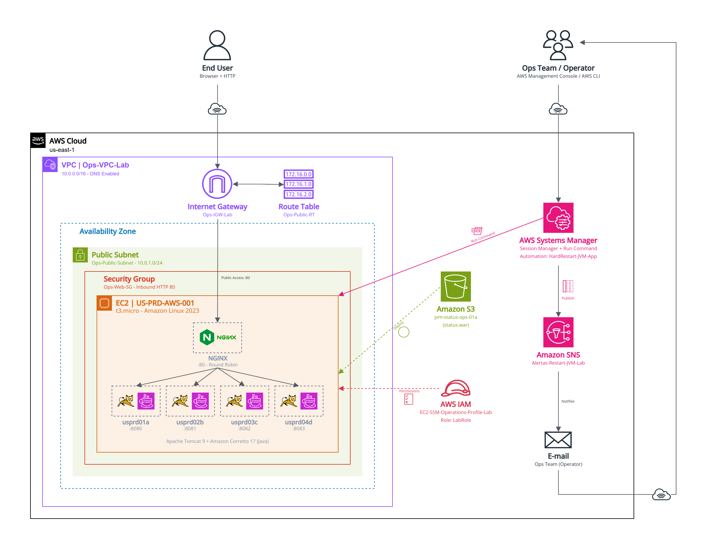
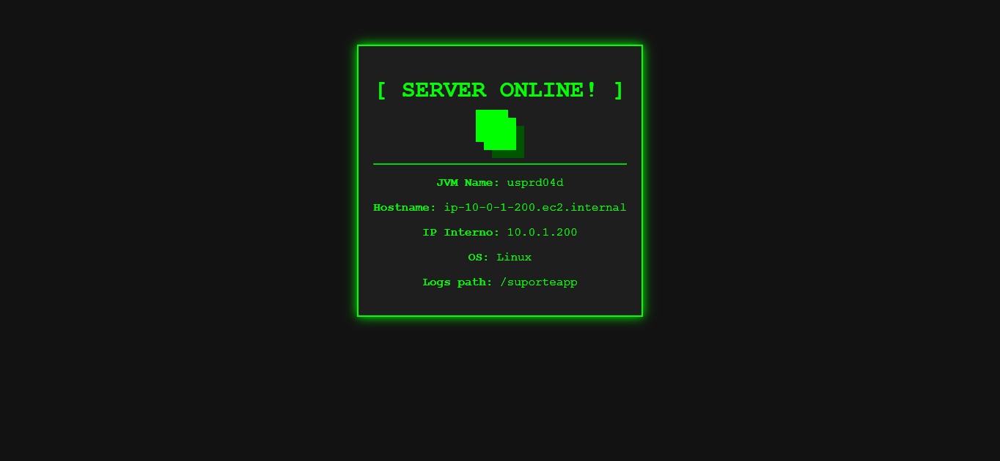
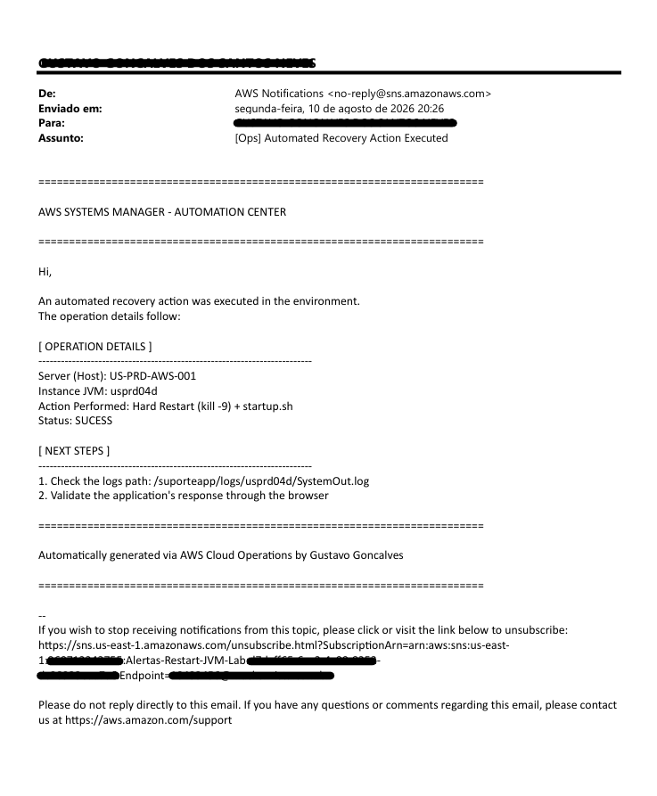

# JVMStatusLab - Automação de Hard-Restart de JVMs com AWS Systems Manager

*Infraestrutura como código, execução remota via SSM e notificações automáticas, um laboratório prático de automação em nuvem, pensado para rodar dentro do Free Tier / AWS Academy Learner Lab (VocLabs).*

## Diagrama da Arquitetura

<p align="center">
  
</p>

## Índice

- [Sobre o Projeto](#sobre-o-projeto)
- [Visão Geral da Arquitetura](#visão-geral-da-arquitetura)
- [Estrutura do Projeto](#estrutura-do-projeto)
- [Tecnologias Utilizadas](#tecnologias-utilizadas)
- [Componentes da Infraestrutura](#componentes-da-infraestrutura)
- [Pré-requisitos](#pré-requisitos)
- [Guia Passo a Passo](#guia-passo-a-passo)
- [Limpeza dos Recursos](#limpeza-dos-recursos)
- [Troubleshooting](#troubleshooting)
- [Limitações e Possíveis Melhorias](#limitações-e-possíveis-melhorias)

## Sobre o Projeto

Este é um projeto de laboratório focado no entendimento prático de conceitos básicos de automação e operações em nuvem, também chamado de ITOps ou CloudOps. O cenário simulado é bastante comum em ambientes que operam aplicações Java: quando uma instância de aplicação (JVM) para de responder, alguém precisa reiniciá-la, de preferência de forma rápida, padronizada, e com o time certo sendo avisado sobre o que aconteceu.

Em vez de depender de acesso manual a cada servidor, o projeto usa o **AWS Systems Manager** para executar essa recuperação remotamente, sem SSH e sem depender de conhecimentos técnicos avançados de quem está disponível no momento, e o **Amazon SNS** para notificar automaticamente quando a ação é executada.

Todo o ambiente foi desenhado para caber nos limites do Free Tier e de laboratórios como o AWS Academy Learner Lab, então algumas decisões de arquitetura, como usar uma Role já existente em vez de criar uma nova, fazem mais sentido quando lidas sob essa ótica e são explicadas ao longo do texto.

## Visão Geral da Arquitetura

Em linhas gerais, o fluxo funciona assim:

1. Uma única instância EC2 hospeda **4 processos Apache Tomcat independentes** (`usprd01a`, `usprd02b`, `usprd03c`, `usprd04d`), cada um numa porta local diferente.
2. Um **NGINX** na frente desses processos atua como proxy reverso / balanceador de carga (round-robin), expondo tudo pela porta 80.
3. Cada JVM serve a mesma aplicação de status (`ROOT.war`), que exibe informações de identificação do processo que respondeu à requisição.
4. O runbook de automação (**SSM Automation Document**) pode ser disparado manualmente, usando a AWS Management Console ou AWS CLI, onde o usuário informa o servidor e a JVM alvo como parâmetros. Ele localiza o processo, força o encerramento, reinicia a aplicação e publica uma notificação no **Amazon SNS**, encaminhada por e-mail.
5. O artefato da aplicação (`status.war`) fica disponível em um **Bucket S3**, de onde é baixado durante a configuração de cada JVM.

> 💡 Para ambientes de Free Tier ou laboratório, onde o número de instâncias simultâneas costuma ser bem limitado e cada instância adicional consome mais cota, ou tempo de sessão, no caso do VocLabs. Rodar múltiplos processos Apache Tomcat em portas diferentes, atrás de um NGINX fazendo o papel de balanceador, permite simular um "cluster" de aplicação gastando uma única `t3.micro`. Em um ambiente real, cada JVM tenderia a viver na sua própria instância, ou container, atrás de um Load Balancer gerenciado (ALB).

## Estrutura do Projeto

```
📁 JVM-AWS-AUTOMATION/
├── 📁 config/
│   ├── cfn_manage_stack.ps1      # Script local (PowerShell) — cria/atualiza a Stack CloudFormation
│   ├── jvms_config.sh            # Script executado na instância EC2 — instala/configura Tomcat, JVMs e NGINX
│   └── s3_manage_object.ps1      # Script local (PowerShell) — envia/remove objetos no S3
├── 📁 infra/
│   └── jvm_infrastructure.yaml   # Template CloudFormation — define toda a infraestrutura AWS
├── 📁 status/
│   ├── 📁 WEB-INF/
│   │   └── web.xml               # Descritor de deployment da aplicação (WEB-INF)
│   └── index.jsp                 # Página JSP que exibe o status de cada JVM
└── README.md                     # Este arquivo
```

## Tecnologias Utilizadas

| Categoria | Tecnologia |
|---|---|
| Infraestrutura como Código (IaC) | AWS CloudFormation |
| Compute | Amazon EC2 |
| Sistema Operacional | Amazon Linux 2023 |
| Rede | Amazon VPC |
| Automação / Execução Remota | AWS Systems Manager (Automation + Session Manager) |
| Notificações | Amazon SNS |
| Armazenamento | Amazon S3 |
| Identidade e Acesso | AWS IAM (Instance Profile) |
| Middleware | Apache Tomcat 9 |
| Runtime | Amazon Corretto (Java 17) + JSP |
| Proxy / Balanceamento | NGINX |
| Automação Local | Windows PowerShell + AWS CLI |

## Componentes da Infraestrutura

A infraestrutura é definida inteiramente em `jvm_infrastructure.yaml`, via AWS CloudFormation. Resumo dos recursos criados:

| Recurso (Logical ID) | Tipo | Nome / Identificador |
|---|---|---|
| `OpsVPC` | `AWS::EC2::VPC` | `Ops-VPC-Lab` (`10.0.0.0/16`) |
| `OpsInternetGateway` | `AWS::EC2::InternetGateway` | `Ops-IGW-Lab` |
| `OpsPublicSubnet` | `AWS::EC2::Subnet` | `Ops-Public-Subnet` (`10.0.1.0/24`) |
| `OpsPublicRouteTable` | `AWS::EC2::RouteTable` | `Ops-Public-RT` |
| `OpsSecurityGroup` | `AWS::EC2::SecurityGroup` | `Ops-Web-SG` |
| `OpsSNSTopic` | `AWS::SNS::Topic` | `Alertas-Restart-JVM-Lab` |
| `EC2InstanceProfile` | `AWS::IAM::InstanceProfile` | `EC2-SSM-Operations-Profile-Lab` |
| `AppServerEC2` | `AWS::EC2::Instance` | Tag `Name = US-PRD-AWS-001` |
| `AppS3Bucket` | `AWS::S3::Bucket` | `jvm-status-ops-01a` |
| `HardRestartJVMDocument` | `AWS::SSM::Document` (Automation) | `HardRestart-JVM-App` |

### Rede (VPC, Subnet, Internet Gateway, Security Group)

A infraestrutura provisiona sua própria rede isolada, o que torna a Stack autossuficiente e portátil entre contas e regiões, desse modo, é possível se concentrar no entendimento de como a construção de automações via AWS SSM funciona:

- Uma **VPC** (`OpsVPC`, `10.0.0.0/16`) com suporte a DNS habilitado;
- Uma **Subnet Pública** (`OpsPublicSubnet`, `10.0.1.0/24`), com atribuição automática de IP público;
- Um **Internet Gateway** (`OpsInternetGateway`) anexado à VPC, e uma **Route Table** (`OpsPublicRouteTable`) com rota `0.0.0.0/0` apontando pra ele;
- Um **Security Group** (`OpsSecurityGroup`) liberando a porta 80, HTTP, pra qualquer origem, com saída padrão liberada.

A porta 80 já fica liberada desde o primeiro deploy, sem precisar de um passo manual depois (ver [Guia Passo a Passo](#guia-passo-a-passo)).

### Instância EC2 (`AppServerEC2`)

Uma única `t3.micro` rodando **Amazon Linux 2023**. Todo o provisionamento inicial acontece via `UserData`, executado automaticamente na primeira inicialização:

- Instala o **Amazon Corretto 17** (JDK da Amazon para Java) e o **NGINX**;
- Cria a estrutura de pastas usada por toda a aplicação: `/suporteapp/app`, `/suporteapp/deploy` e `/suporteapp/logs/<jvm>` para cada uma das 4 JVMs;
- Ajusta o dono das pastas para `ec2-user`, que evita rodar a aplicação como `root`;
- Habilita e inicia o NGINX.

A instância está associada à `OpsPublicSubnet` e ao `OpsSecurityGroup` descritos acima, isolado da infraestrutura da VPC default da conta. Repare que o template **não define** um par de chaves (`KeyName`), o acesso é feito inteiramente via **SSM Session Manager**, sem depender de SSH.

### IAM Instance Profile (`EC2InstanceProfile`)

Para a instância conseguir falar com o SSM, que é essencial para tudo, como Session Manager, Run Command e a Automation, ela precisa de um Instance Profile associado a uma Role com as permissões corretas, basicamente, a policy gerenciada `AmazonSSMManagedInstanceCore`.

Em contas normais, o caminho comum seria criar uma Role nova só para isso. Em contas de estudante ou laboratório, como o AWS Academy Learner Lab, a criação de novas Roles costuma ser bloqueada por política da conta. Por esse motivo, o template recebe o nome de uma Role **já existente** como parâmetro, o `ExistingLabRoleName`, padrão `LabRole`, e apenas associa essa Role ao Instance Profile.

### Bucket S3 (`AppS3Bucket`)

Armazena o artefato `status.war`, o "pacote" da aplicação distribuído para as 4 JVMs. O objetivo é ter um repositório simples de deploy, onde é possível realizar o download do objeto diretamente na instância usando a AWS CLI.

### Tópico SNS (`OpsSNSTopic`)

Canal de notificação usado pelo runbook para avisar quando uma ação de recuperação é executada. A mensagem é formatada como texto simples com bordas em ASCII, pois ambientes de laboratório geralmente só suportam esse formato para e-mails via SNS, sem HTML. A inscrição, o e-mail que recebe os alertas, **não é criada automaticamente** pelo template, fica como passo manual (ver [Guia Passo a Passo](#guia-passo-a-passo)), já que em laboratório costuma ser mais simples cadastrar isso direto pelo Console.

### Documento de Automação SSM (`HardRestartJVMDocument`)

O coração da automação. Um runbook do tipo `Automation` (schema `0.3`) com dois passos:

**1. `ExecutarRestart`** — via `aws:runCommand`, executa remotamente, na instância identificada pela tag `Name`, um shell script bem simples:

```bash
JVM="{{ JvmName }}"
PID=$(ps -ef | grep "/suporteapp/app/tomcat_$JVM" | grep -v grep | awk '{print $2}')
if [ -n "$PID" ]; then
    kill -9 $PID
    sleep 5
fi
sudo su - ec2-user -c "sh /suporteapp/app/tomcat_$JVM/bin/startup.sh"
```

Ou seja: localiza o processo da JVM informada, força o encerramento (`kill -9`), aguarda 5 segundos e sobe a aplicação de novo pelo script padrão do Apache Tomcat.

> 💡 Em produção, o ideal é sempre tentar primeiro um encerramento "gracioso" usando o `shutdown.sh`, que envia SIGTERM e dá chance da JVM fechar conexões e liberar recursos antes de morrer, deixando o `kill -9`/SIGKILL como último recurso. O nome do runbook (`HardRestart`) é proposital: o objetivo aqui é simular justamente um cenário de uma JVM travada, que não responde nem a um shutdown gracioso, executando um script simples. 
> 
> Uma evolução natural seria a automação tentar `shutdown.sh` primeiro, com um timeout, e só cair para `kill -9` se o processo continuar de pé depois disso.

**2. `NotificarOps`** — via `aws:executeAwsApi`, publica uma mensagem no tópico SNS com os detalhes da ação, contendo o nome do servidor, JVM, o que foi feito, e os próximos passos sugeridos pra quem receber o alerta.

> 💡 Para um único servidor, conectar à instância via SSH resolveria o problema rapidamente. A automação compensa justamente quando esse cenário se repete ou se multiplica: garante que o mesmo procedimento seja executado sempre da mesma forma, não depende de quem está de plantão, nem de "como cada um faria do seu jeito", além disso, a execução fica registrada no histórico de execuções do SSM, incluindo quem rodou, quando, com quais parâmetros, e não exige distribuir acesso interativo, como via SSH ou Session Manager, pra todo mundo que possa eventualmente precisar reiniciar algo.
>
> A mesma automação também poderia ser disparada automaticamente por um alarme/alerta do Amazon CloudWatch, sem nenhuma intervenção humana.

### NGINX + Apache Tomcat (Camada de Aplicação)

Diferente dos recursos acima, o NGINX e as 4 instâncias do Tomcat **não são gerenciados pelo CloudFormation**, são instalados e configurados depois que a instância já está no ar, através do `jvms_config.sh` (ver [Guia Passo a Passo](#guia-passo-a-passo)), facilitando o entendimento dos passos realizados. Cada JVM roda o Apache Tomcat 9.0.120 em seu próprio diretório (`tomcat_usprd01a`, `tomcat_usprd02b`, `tomcat_usprd03c`, `tomcat_usprd04d`), com sua própria porta e seu próprio `setenv.sh` definindo variáveis como `JVM_NAME` e o caminho do log (`CATALINA_OUT`). O NGINX distribui as requisições entre as 4 portas locais em round-robin.

### Aplicação de Status (`index.jsp` + `web.xml` → `status.war`)

A aplicação usada como exemplo é simples e objetiva: uma única página JSP que usa a API `InetAddress` do Java pra capturar hostname e IP da máquina, `System.getProperty("os.name")` pro sistema operacional, e a variável de ambiente `JVM_NAME`, definida no `setenv.sh` de cada JVM, pra identificar qual instância respondeu. O `web.xml` só declara o nome da aplicação, não há nenhum Servlet mapeado, então o próprio Tomcat serve o `index.jsp` como página padrão.

Compilada como `ROOT.war`, ela fica acessível na raiz (`/`) de cada JVM. Assim que uma requisição chega, ao executar a aplicação, repare que o `Hostname` e o `IP Interno` são os mesmos em qualquer uma das 4 JVMs, afinal, é a mesma instância EC2, o que muda de verdade é o `JVM Name`.

## Pré-requisitos

- **Conta AWS** — pode ser uma conta pessoal (Free Tier) ou um ambiente de laboratório como o **AWS Academy Learner Lab / VocLabs da Vocareum Labs**. Se for laboratório, vale ter em mente algumas particularidades:
  - Sessões costumam ter duração limitada e as credenciais expiram, normalmente é preciso copiar as credenciais temporárias, Access Key, Secret Key e **Session Token**, do painel do laboratório pro seu `~/.aws/credentials` sempre que a sessão for renovada;
  - Não é possível criar novas Roles/Policies IAM, por isso o template usa uma Role já existente, como a `LabRole`, por padrão;
  - A região costuma ser fixa, geralmente `us-east-1`, e o tipo de instância costuma ser limitado a famílias pequenas, como `t2.micro` e `t3.micro`;
  - Os recursos são apagados automaticamente ao final do laboratório, nada aqui é permanente entre sessões, a menos que você reimplante. Em alguns laboratórios que utilizam créditos, os recursos ficam salvos até que os créditos se esgotem.
- **AWS CLI** — instalado e configurado, utilize o `aws configure`, ou as credenciais temporárias do laboratório;
- **Windows PowerShell** — os scripts de automação local, como `cfn_manage_stack.ps1`, `s3_manage_object.ps1`, foram escritos pra PowerShell. Em Linux/macOS, os mesmos comandos `aws` funcionam normalmente em Bash, só adaptando a quebra de linha `` ` `` do PowerShell vira `\` no Bash;
- **JDK** instalado localmente — necessário pra empacotar o `status.war` com o comando `jar`;
- Um **navegador**, pra validar a aplicação;
- **Plugin do Session Manager para o AWS CLI** — opcional, só necessário se você quiser usar `aws ssm start-session` pelo terminal. Pelo Console da AWS, o Session Manager funciona direto pelo navegador, sem instalar nada extra e recomendado pra quem está começando.

## Guia Passo a Passo

> ⚠️ É recomendado alterar os nomes dos recursos para identificadores únicos no seu ambiente, por exemplo: `meuapp-prod-bucket-2026`, pois alguns serviços AWS não aceitam nomes duplicados.

### 1. Empacotando a aplicação de status (`status.war`)

O projeto inclui o código-fonte da aplicação (`index.jsp` e `web.xml`), mas não o `.war` já compilado, esse pacote precisa ser gerado antes de tudo, já que os passos seguintes dependem dele. Organize os arquivos seguindo a estrutura padrão de uma aplicação Web Java:

```
status-app/
├── index.jsp
└── WEB-INF/
    └── web.xml
```

E gere o `.war` com o próprio JDK:

```powershell
mkdir status-app\WEB-INF
copy index.jsp status-app\
copy web.xml status-app\WEB-INF\
cd status-app
jar -cvf ..\status.war *
cd ..
```

*(Em Linux/macOS: `mkdir -p status-app/WEB-INF`, `cp` no lugar de `copy`, e o mesmo comando `jar`.)*

### 2. Implantando a infraestrutura (CloudFormation)

Com o `jvm_infrastructure.yaml`, crie a Stack:

```powershell
aws cloudformation create-stack `
--stack-name JVMStatusLab `
--template-body file://infra/jvm_infrastructure.yaml `
--capabilities CAPABILITY_NAMED_IAM
```

Esse comando já provisiona toda a stack de rede, VPC, Subnet, Internet Gateway e Security Group, junto com o compute, o storage e a automação, não sobra nenhum recurso de rede pra configurar manualmente depois.

> 💡 O `--capabilities CAPABILITY_NAMED_IAM` é obrigatório porque a Stack cria um recurso de IAM com nome definido explicitamente, o Instance Profile. Sem essa flag, a criação falha pedindo essa confirmação, é uma proteção da AWS contra criação não intencional de recursos de identidade e acesso.

Se o nome da Role padrão do seu laboratório for diferente de `LabRole`, em alguns ambientes é `voclabs`, informe o parâmetro:

```powershell
aws cloudformation create-stack `
--stack-name JVMStatusLab `
--template-body file://infra/jvm_infrastructure.yaml `
--parameters ParameterKey=ExistingLabRoleName,ParameterValue=NOME_DA_SUA_ROLE `
--capabilities CAPABILITY_NAMED_IAM
```

Acompanhe o status até `CREATE_COMPLETE` através do AWS Management Console ou executando o comando:

```powershell
aws cloudformation describe-stacks --stack-name JVMStatusLab --query "Stacks[0].StackStatus"
```

Pra reaplicar alguma alteração no template mais tarde, use o `update-stack`:

```powershell
aws cloudformation update-stack `
--stack-name JVMStatusLab `
--template-body file://infra/jvm_infrastructure.yaml `
--capabilities CAPABILITY_NAMED_IAM
```

> ⚠️ Nomes de Bucket S3 são únicos **globalmente** entre todas as contas AWS do mundo, não só a sua. Se o nome já estiver em uso por outra conta, o deploy vai falhar. Ajuste o `BucketName` no template antes de tentar de novo.

### 3. Enviando o `status.war` para o S3

Com o Bucket já criado pela Stack, envie o pacote gerado no Passo 1:

```powershell
aws s3api put-object `
--bucket jvm-status-ops-01a `
--key status.war `
--body .\status.war
```

### 4. Confirmando a Inscrição de E-mail no SNS

A criação automática da inscrição foi deixada de fora do template, pois, para os fins objetivos deste laboratório de testar a automação, é recomendado que a criação das subscrições seja realizada pelo AWS Management Console. Caso deseje executar via AWS CLI, basta seguir os comandos:

```powershell
aws sns list-topics `
--query "Topics[?contains(TopicArn, 'Alertas-Restart-JVM-Lab')].TopicArn" `
--output text
```

E crie a inscrição com o seu e-mail:

```powershell
aws sns subscribe `
--topic-arn ARN_OBTIDO_ACIMA `
--protocol email `
--notification-endpoint seu-email@exemplo.com
```

Confirme a inscrição pelo link que chega na sua caixa de entrada, sem essa confirmação, o tópico não entrega nada.

### 5. Conectando à Instância via SSM Session Manager

Sem chave SSH, a conexão é feita pelo próprio Console: **EC2 → Instâncias → selecione a instância com tag `US-PRD-AWS-001` → Conectar → Session Manager → Conectar**. Isso abre um terminal direto no navegador.

*(Alternativa via AWS CLI, exige o plugin do AWS Session Manager instalado localmente: `aws ssm start-session --target ID_DA_INSTANCIA`.)*

### 6. Instalando e Configurando o Tomcat e as 4 JVMs

Com a sessão aberta, siga o `jvms_config.sh`, ele foi pensado pra ser executado por partes manualmente, já que tem alguns pontos de edição manual, facilitando o entendimento dos passos para quem está iniciando. Resumo dos blocos:

1. Baixa e extrai o Apache Tomcat 9.0.120 em `/tmp`;
2. Copia a mesma instalação 4 vezes, uma pra cada JVM (`tomcat_usprd01a` a `tomcat_usprd04d`);
3. **Edição manual:** ajusta as portas de cada `server.xml`, a primeira JVM mantém as portas padrão do Tomcat, as demais precisam mudar. Pode ser feito via `vi`/`nano`, ou de forma mais direta com `sed`, assumindo o `server.xml` padrão do Tomcat, sem modificações prévias:

   | JVM | Porta do Server | Porta do Connector |
   |---|---|---|
   | `usprd01a` | 8005 *(padrão)* | 8080 *(padrão)* |
   | `usprd02b` | 8006 | 8081 |
   | `usprd03c` | 8007 | 8082 |
   | `usprd04d` | 8008 | 8083 |

4. Garante o ownership das pastas pro `ec2-user`;
5. Baixa o `status.war` do S3 e copia pra pasta central de deploy (`/suporteapp/deploy/ROOT.war`);
6. Remove o `ROOT` padrão de boas-vindas de cada JVM (`webapps/ROOT*`) antes de distribuir a versão nova, o Tomcat já sobe com essa pasta extraída por padrão, e sem essa limpeza ele pode continuar servindo a página antiga em vez da aplicação;
7. Copia o `ROOT.war` pras 4 JVMs, assim cada uma serve a aplicação na raiz `/`, sem precisar de um contexto extra na URL;
8. Cria o `setenv.sh` de cada JVM, definindo `JVM_NAME`, usado pela página de status, e o caminho do log (`CATALINA_OUT`);
9. Sobe as 4 JVMs com `startup.sh`.

### 7. Configurando o NGINX como Balanceador

Ainda no `jvms_config.sh`, o último bloco manual é o NGINX. Edite `/etc/nginx/nginx.conf` e, **dentro do bloco `http { }` mas fora do bloco `server { }`**, adicione:

```nginx
upstream cluster_jvms {
    server 127.0.0.1:8080; # usprd01a
    server 127.0.0.1:8081; # usprd02b
    server 127.0.0.1:8082; # usprd03c
    server 127.0.0.1:8083; # usprd04d
}
```

E, dentro do bloco `server { }` já existente, ajuste o `location / { }` pra apontar pra esse grupo:

```nginx
server {
    listen 80;
    server_name _;
    location / {
        proxy_pass http://cluster_jvms;
        proxy_set_header Host $host;
        proxy_set_header X-Real-IP $remote_addr;
    }
}
```

Reinicie o NGINX pra aplicar:

```bash
sudo systemctl restart nginx
```

### 8. Validando o Ambiente

Confirme que os 4 processos estão de pé:

```bash
ps -ef | grep tomcat
```

A porta 80 já fica liberada pelo Security Group criado junto com a Stack, pegue o IP público através do AWS Management Console ou através do comando abaixo e acesse pelo navegador:

```powershell
aws ec2 describe-instances `
--filters "Name=tag:Name,Values=US-PRD-AWS-001" `
--query "Reservations[].Instances[].PublicIpAddress" `
--output text
```

Ao atualizar a página algumas vezes, o `JVM Name` exibido deve alternar entre as 4 instâncias, é um sinal de que o balanceamento round-robin do NGINX está funcionando.

<p align="center">
  
</p>

### 9. Testando a Automação de Hard Restart

Pelo Console: **Systems Manager → Automação → Executar automação → busque `HardRestart-JVM-App`** → informe `HostName` (`US-PRD-AWS-001`) e `JvmName` (ex.: `usprd01a`) → Executar.

Ou via AWS CLI:

```powershell
aws ssm start-automation-execution `
--document-name "HardRestart-JVM-App" `
--parameters "HostName=US-PRD-AWS-001,JvmName=usprd01a"
```

Acompanhe os passos (`ExecutarRestart` e `NotificarOps`) na execução, e confira se o e-mail configurado no passo 4 chegou, com o assunto `[Ops] Automated Recovery Action Executed`.

<p align="center">
  
</p>

## Limpeza dos Recursos

Especialmente importante em ambientes de laboratório e Free Tier, nada aqui gera custo se for apagado direito, mas vale o hábito.

> ⚠️ O `cfn_manage_stack.ps1` não inclui um comando de exclusão, os comandos abaixo foram adicionados aqui pra fechar esse fluxo, já que laboratórios costumam ter cota e/ou tempo de sessão limitados.

**1. Esvazie o Bucket S3 primeiro.** O CloudFormation só consegue apagar um bucket vazio, se o `status.war` ainda estiver lá, a exclusão da Stack falha nesse recurso:

```powershell
aws s3api delete-object `
--bucket jvm-status-ops-01a `
--key status.war
```

**2. Apague a Stack:**

```powershell
aws cloudformation delete-stack `
--stack-name JVMStatusLab
```

Isso também remove a VPC, a Subnet, o Internet Gateway e o Security Group criados junto com ela, não sobra nenhum recurso de rede órfão pra apagar à parte.

**3. Acompanhe através do AWS Management Console ou usando o comando abaixo até a exclusão terminar:**

```powershell
aws cloudformation describe-stacks --stack-name JVMStatusLab
```

*(Quando esse comando retornar um erro dizendo que a Stack não existe mais, a exclusão foi concluída.)*

## Troubleshooting

- **A instância não aparece no Session Manager / Fleet Manager** — aguarde alguns minutos após o `CREATE_COMPLETE`, o agente do SSM leva um tempo pra se registrar, e confirme que o Instance Profile foi associado corretamente.
- **Erro pedindo `CAPABILITY_NAMED_IAM`** — faltou incluir essa flag no `create-stack`/`update-stack` (ver [passo 2](#guia-passo-a-passo)).
- **Erro de Role/Instance Profile ao criar a Stack** — o nome padrão (`LabRole`) pode variar entre laboratórios, às vezes é `voclabs`, ajuste o parâmetro `ExistingLabRoleName`.
- **Erro de bucket já existente** — nomes de bucket S3 são únicos globalmente; troque o `BucketName` no template.
- **`ImageId` inválido / AMI não encontrada** — o ID de AMI do template é específico da região, `us-east-1`, geralmente, em ambientes AWS Academy. Em outra região, busque o ID correto do Amazon Linux 2023 por lá.
- **502 Bad Gateway no NGINX** — normalmente significa que uma ou mais JVMs ainda não subiram, ou falharam ao subir. Confira com `ps -ef | grep tomcat` e os logs em `/suporteapp/logs/<jvm>/SystemOut.log`.
- **Página não carrega no navegador, mas os processos estão de pé** — provavelmente é o Security Group; confirme que o `OpsSecurityGroup` está mesmo associado à instância e com a porta 80 liberada (ver [Componentes da Infraestrutura](#componentes-da-infraestrutura)). Importante verificar se o navegador não está forçando o uso do HTTPS, se estiver, basta substituir por HTTP.
- **Credenciais expiradas** — a sessão do laboratório tem duração limitada, copie as credenciais temporárias atualizadas pro `~/.aws/credentials` sempre que necessário.
- **A automação não encontra o alvo (`Targets`)** — confirme que a tag `Name` da instância é exatamente igual ao `HostName` informado na execução.

## Limitações e Possíveis Melhorias

> 💡 O objetivo aqui não foi entregar algo pronto pra produção, e sim consolidar na prática alguns conceitos fundamentais, Infraestrutura como Código, execução remota sem acesso interativo, notificação assíncrona, de maneira bem simples, de modo que quem esteja iniciando entenda o funcionamento das automações, dentro das limitações de um ambiente gratuito/laboratorial.
